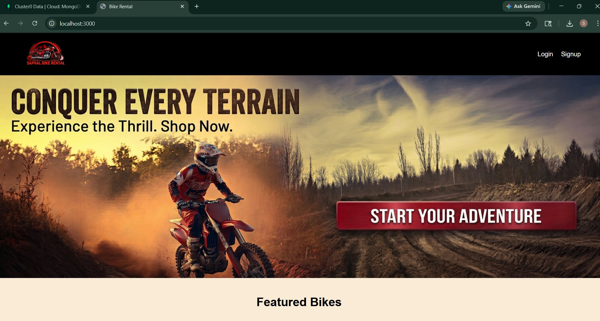
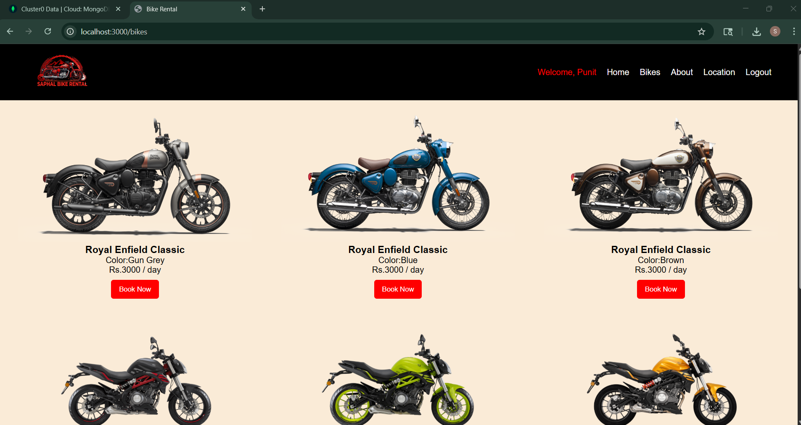
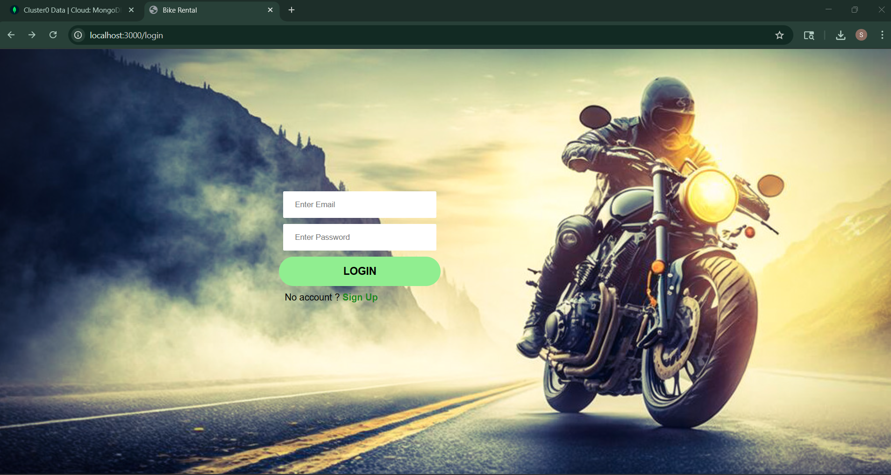
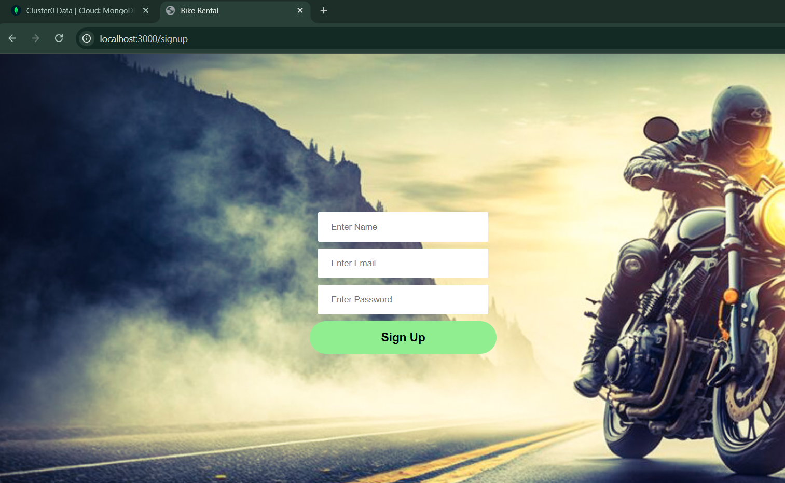
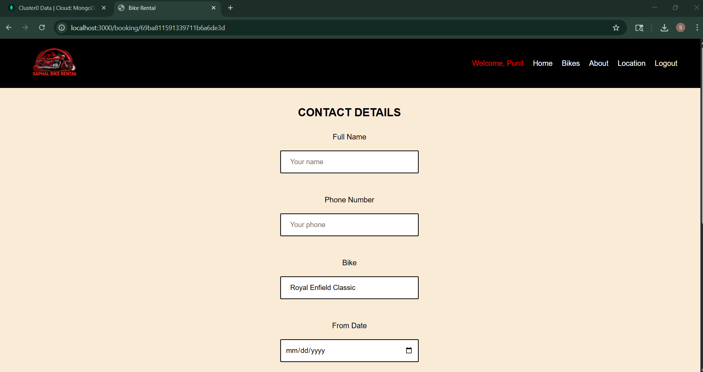

# 🚲 Bike Rental System

A full stack web application for renting bikes online. Users can register, log in, browse available bikes, make bookings, and view booking confirmations — all with secure JWT-based authentication.

---

## 🌟 Features

- 🔐 User Registration & Login with JWT Authentication
- 🍪 Secure cookie-based session management
- 🚲 Browse available bikes
- 📅 Book a bike with start and end dates
- ✅ Booking confirmation page
- 🔒 Protected routes — only logged in users can book
- 🧭 Dynamic navbar — shows different links based on login status
- 🚪 Logout functionality

---

## 🛠️ Tech Stack

| Layer | Technology |
|-------|-----------|
| Frontend | HTML, CSS, JavaScript, EJS |
| Backend | Node.js, Express.js |
| Database | MongoDB, Mongoose |
| Auth | JWT (JSON Web Tokens), Cookies |
| Version Control | Git, GitHub |

---

## 📸 Screenshots


| Page | Preview |
|------|---------|
| Home Page |  |
| Bikes Page |  |
| Login Page |  |
| Login Page |  |
| Booking Page |  |


---

## 🚀 Getting Started

### Prerequisites

Make sure you have these installed:

- [Node.js](https://nodejs.org/) (v14 or higher)
- [MongoDB](https://www.mongodb.com/) (local or Atlas)
- [Git](https://git-scm.com/)

### Installation

1. **Clone the repository**
```bash
git clone https://github.com/saphalthedeveloper-cyber/Rental-Bike.git
cd Rental-Bike
```

2. **Install dependencies**
```bash
npm install
```

3. **Set up environment variables**

Create a `.env` file in the root folder:
```env
PORT=3000
MONGO_URI=your_mongodb_connection_string
JWT_SECRET=your_jwt_secret_key
```

4. **Run the app**
```bash
node app.js
```

5. **Open in browser**
```
http://localhost:3000
```

---

## 📁 Project Structure

```
Rental-Bike/
│
├── models/
│   ├── user.js          # User schema
│   ├── bike.js          # Bike schema
│   └── booking.js       # Booking schema
│
├── middleware/
│   └── authMiddleware.js # requireAuth & checkUser
│
├── views/
│   ├── home.ejs
│   ├── bikes.ejs
│   ├── login.ejs
│   ├── signup.ejs
│   └── booking.ejs
│
├── public/
│   └── css/             # Stylesheets
│
├── app.js               # Main server file
└── package.json
```

---

## 🔐 How Authentication Works

```
User logs in
     ↓
Server creates JWT token
     ↓
Token stored in browser cookie
     ↓
Every request sends cookie automatically
     ↓
requireAuth middleware verifies token
     ↓
Protected routes accessible ✅
```

---

## 📌 API Routes

| Method | Route | Description | Protected |
|--------|-------|-------------|-----------|
| GET | `/home` | Home page | No |
| GET | `/bikes` | Browse all bikes | No |
| GET | `/login` | Login page | No |
| POST | `/login` | Login user | No |
| GET | `/signup` | Signup page | No |
| POST | `/signup` | Register user | No |
| POST | `/booking` | Create a booking | ✅ Yes |
| GET | `/booking/:bikeId` | Booking confirmation | ✅ Yes |
| GET | `/logout` | Logout user | No |

---

## 🌱 Future Improvements

- [ ] Deploy on Render or Railway
- [ ] Add input validation with Joi
- [ ] Add admin dashboard to manage bikes
- [ ] Add payment integration
- [ ] Make fully mobile responsive
- [ ] Add bike search and filter

---

## 👨‍💻 Author

**Saphal Singh Suwal**

- GitHub: [@saphalthedeveloper-cyber](https://github.com/saphalthedeveloper-cyber)
- Email: saphalthedeveloper@gmail.com
- Location: Kathmandu, Nepal

---


